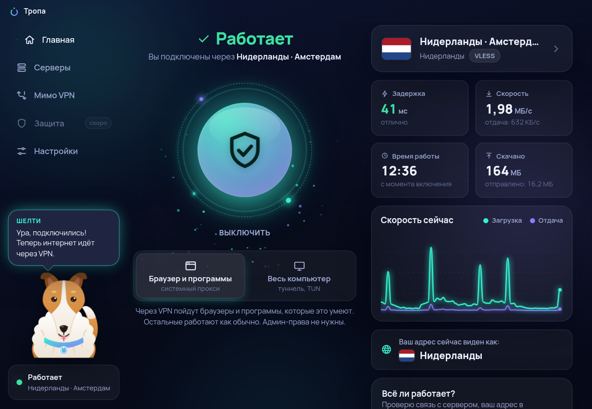

# Тропа — простой VPN-клиент для Windows

Вставил ключ — нажал кнопку. Для тех, кто не хочет знать слов «прокси», «DNS» и «туннель».

Клиент для готового ключа (VPN-сервер не входит). Внутри — движок [sing-box](https://github.com/SagerNet/sing-box).

* Что готово, что нет и как запустить: **[ОТЧЁТ.md](ОТЧЁТ.md)**
* Какие решения я принял сам и почему: **[РЕШЕНИЯ.md](РЕШЕНИЯ.md)**



## Быстрый старт (Windows)

```
npm install
npm run fetch:singbox -- --target win32-x64
npm run build
npm start
```

## Для разработчика

| Команда | Что делает |
|---|---|
| `npm run dev` | окно с живой перезагрузкой |
| `npm run ui` | только оформление в браузере, с тестовыми данными |
| `npm test` | 280+ автотестов (нужен sing-box: `npm run fetch:singbox`) |
| `npm run test:e2e` | настоящее окно в Electron (под Linux — через `xvfb-run`) |
| `npm run typecheck` | проверка типов |
| `npm run screenshots` | снимки окна в разных оформлениях |

Название приложения меняется в одном месте — `brand.json`.

Модуль `core/` (разбор ключей и сборка настроек) не зависит от Electron и Node — его можно переносить в версию под Android.
